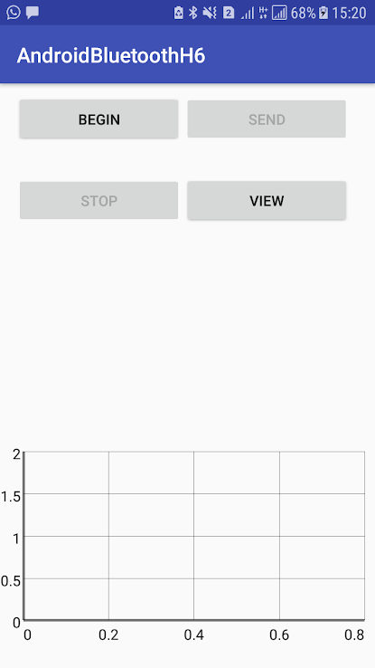

# Muscle Resistivity Calculating Machine
This project build to calculate Baseball players strength. It is calculate players passing speed and display it to analyzing data.

## Application
1. Muscle Resistivity calculating android application
2. Muscle Resistivity check arduino application.

## How It works
  It measure human strength of hand using arduino. It used various of sensors. Finaly mesurement sent to android device though bluetooth technology.

### In Andoird app,
  Handle those bluetooth data and calculated strength of player. and providing graph to analysing data. It help to idenfify players ability.
  
  ### Google Play store link [link](https://play.google.com/store/apps/details?id=com.xiteb.randikawann.bluetoothh6&hl=en)
  
  ### Screenshots
  
  
